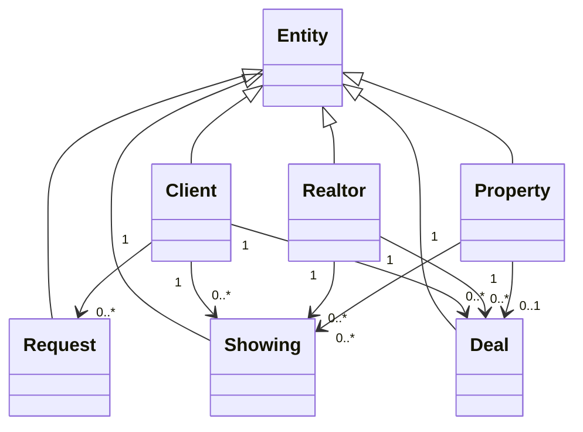
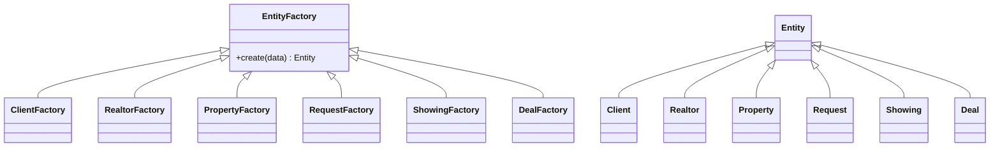
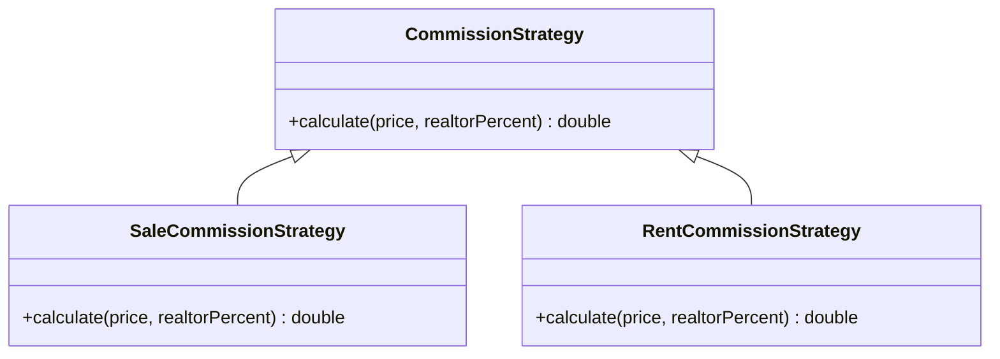
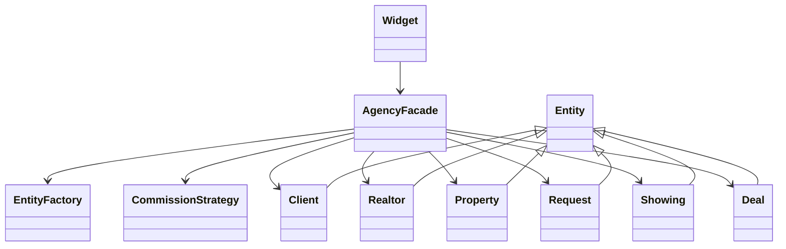

# Лабораторная работа №8

## Тема

**Разработка приложения для организации взаимодействия объектов предметной области «Агентство недвижимости».**

## 1. Постановка задачи

Необходимо разработать приложение для учета работы агентства недвижимости. Приложение должно хранить сведения о клиентах, риелторах, объектах недвижимости, заявках клиентов, показах объектов и сделках. В программе должна быть показана многозначная зависимость: один клиент может иметь несколько заявок, показов и сделок; один риелтор может вести несколько показов и сделок; один объект недвижимости может участвовать в нескольких показах, но после сделки получает статус «Продан» или «Сдан».

## 2. Сущности предметной области

### 2.1. Клиенты

| Поле | Программное имя | Смысл |
|---|---|---|
| ID клиента | `id` | Уникальный идентификатор клиента |
| ФИО | `fullName` | Фамилия, имя и отчество клиента |
| Телефон | `phone` | Контактный телефон |
| Бюджет | `budget` | Максимальная сумма покупки или аренды |
| Желаемый район | `preferredDistrict` | Район, который интересует клиента |

### 2.2. Риелторы

| Поле | Программное имя | Смысл |
|---|---|---|
| ID риелтора | `id` | Уникальный идентификатор риелтора |
| ФИО | `fullName` | ФИО сотрудника агентства |
| Телефон | `phone` | Контактный телефон |
| Специализация | `specialization` | Продажа, аренда, элитная недвижимость |
| Комиссия | `commissionPercent` | Процент комиссии риелтора |

### 2.3. Объекты недвижимости

| Поле | Программное имя | Смысл |
|---|---|---|
| ID объекта | `id` | Уникальный идентификатор объекта |
| Адрес | `address` | Адрес недвижимости |
| Район | `district` | Район расположения |
| Тип | `type` | Квартира, дом, коммерческая недвижимость |
| Комнаты | `rooms` | Количество комнат |
| Площадь | `area` | Площадь в квадратных метрах |
| Цена | `price` | Цена продажи или аренды |
| Статус | `status` | Свободен, забронирован, продан, сдан |

### 2.4. Заявки

| Поле | Программное имя | Смысл |
|---|---|---|
| ID заявки | `id` | Уникальный идентификатор заявки |
| ID клиента | `clientId` | Клиент, который оставил заявку |
| Тип объекта | `targetType` | Требуемый тип недвижимости |
| Район | `district` | Желаемый район |
| Мин. комнат | `minRooms` | Минимальное количество комнат |
| Макс. цена | `maxPrice` | Предельная стоимость |
| Активность | `active` | Признак открытой заявки |

### 2.5. Показы

| Поле | Программное имя | Смысл |
|---|---|---|
| ID показа | `id` | Уникальный идентификатор показа |
| ID клиента | `clientId` | Клиент, который смотрел объект |
| ID объекта | `propertyId` | Показываемый объект недвижимости |
| ID риелтора | `realtorId` | Ответственный риелтор |
| Дата | `date` | Дата показа |
| Результат | `result` | Итог показа |

### 2.6. Сделки

| Поле | Программное имя | Смысл |
|---|---|---|
| ID сделки | `id` | Уникальный идентификатор сделки |
| ID клиента | `clientId` | Клиент, заключивший сделку |
| ID объекта | `propertyId` | Объект сделки |
| ID риелтора | `realtorId` | Ответственный риелтор |
| Дата | `date` | Дата сделки |
| Операция | `operation` | Продажа или аренда |
| Итоговая цена | `finalPrice` | Сумма сделки |
| Комиссия | `commission` | Рассчитанная комиссия агентства |
| Статус | `status` | Состояние сделки |

## 3. Функционал приложения

1. Добавление клиентов.
2. Добавление риелторов.
3. Добавление объектов недвижимости.
4. Создание заявок клиентов на подбор недвижимости.
5. Регистрация показов объектов клиентам.
6. Заключение сделок продажи или аренды.
7. Автоматический расчет комиссии по сделке.
8. Автоматическое изменение статуса объекта после сделки.
9. Подбор подходящих объектов по заявке клиента.
10. Вывод каждой сущности в отдельную таблицу.

## 4. Использованные паттерны проектирования

### 4.1. Factory Method — порождающий паттерн

Используется в файлах `entityfactory.h` и `entityfactory.cpp`. Абстрактный класс `EntityFactory` задает метод `create()`. Конкретные фабрики `ClientFactory`, `RealtorFactory`, `PropertyFactory`, `RequestFactory`, `ShowingFactory`, `DealFactory` создают соответствующие сущности.

### 4.2. Strategy — поведенческий паттерн

Используется в файлах `commissionstrategy.h` и `commissionstrategy.cpp`. Интерфейс `CommissionStrategy` задает метод `calculate()`. Классы `SaleCommissionStrategy` и `RentCommissionStrategy` реализуют разные алгоритмы расчета комиссии для продажи и аренды.

### 4.3. Facade — структурный паттерн

Используется в файлах `agencyfacade.h` и `agencyfacade.cpp`. Класс `AgencyFacade` скрывает работу со всеми коллекциями сущностей, фабриками, подбором объектов и заключением сделок. Форма `Widget` обращается к одному фасаду, а не к каждой сущности отдельно.

### 4.4. Observer — поведенческий паттерн на основе сигналов Qt

Класс `AgencyFacade` отправляет сигнал `dataChanged()`, а `Widget` подписывается на него и обновляет таблицы. Это позволяет автоматически синхронизировать интерфейс после добавления клиента, объекта, заявки, показа или сделки.

## 5. UML-диаграммы в формате Mermaid

### 5.1. Диаграмма сущностей

### 5.2. Паттерн Factory Method

### 5.3. Паттерн Strategy

### 5.4. Общая диаграмма классов

## 6. Структура меню программы

Главная форма содержит вкладки:

1. **Клиенты** — форма добавления клиента и таблица клиентов.
2. **Риелторы** — форма добавления риелтора и таблица риелторов.
3. **Объекты** — форма добавления недвижимости и таблица объектов.
4. **Заявки** — форма создания заявки клиента и таблица заявок.
5. **Показы** — форма регистрации показа и таблица показов.
6. **Сделки** — форма заключения сделки и таблица сделок.
7. **Подбор** — выбор заявки и вывод подходящих объектов.

## 7. Вывод

В ходе работы была разработана предметная область «Агентство недвижимости» с шестью сущностями. Реализована многозначная зависимость между клиентами, риелторами, объектами, показами и сделками. В программе применены паттерны Factory Method, Strategy, Facade и Observer. Приложение позволяет добавлять данные, отображать их в таблицах, подбирать объекты по заявке и заключать сделки с автоматическим расчетом комиссии.
